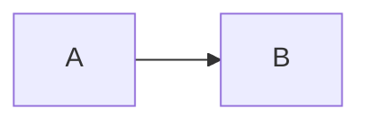

# sqlite-cms

[](https://github.com/tett23/sqlite-cms/actions/workflows/ci.yml)

Markdown で書いた記事から、軽い個人サイトを作って Cloudflare や GitHub Pages などに公開するツール。
記事は全部まとめて一つの SQLite に入り、ブラウザはそれを一度読み込むだけで、あとはページを移るたびにサーバへ記事を取りに行かない（画像は除く）。
見た目は白背景に黒文字、青い下線のリンクだけの、古いウェブサイトのようなものになる。

使うのは `sqlite-cms` コマンドだけ。記事は自分のリポジトリ（以下、記事リポジトリ）で管理する。

見本：<https://gentle-tooth-fe80.tett23.workers.dev/>（このリポジトリの `example/` を公開したもの）

## 特徴

- **一つのコマンド**：記事の雛形づくり、手元でのプレビュー、公開まで、Rust で書いた `sqlite-cms` だけで行う。公開先は Cloudflare Workers、GitHub Pages、rsync で送る任意のサーバーから選べる。Node や wrangler は要らない。
- **一つの SQLite**：全記事を一つの SQLite にまとめて配信する。ブラウザは最初に一度読み込むだけで、以後はページを移っても記事を取りに行かない。
- **Markdown**：CommonMark と GFM に加えて、[Zenn](https://zenn.dev/zenn/articles/markdown-guide) 風の拡張（メッセージ、折りたたみ、コードのファイル名と diff、数式、mermaid の図、画像の幅、インラインの脚注、リンクカード）が書ける。
- **コードの色分け**：Shiki で、VS Code と同じ文法の定義で色を付ける。
- **全文検索**：ヘッダの検索ボックスから、全記事を日本語でも探せる。索引はブラウザの中で作るので、サーバーは要らない。
- **軽さ**：色分け、数式、図のライブラリは、要るページでだけ後から読み込む。リンクカードの画像もビルドのときに取ってきて自分のサイトから配信するので、読む人のブラウザはほかのサイトと通信しない。
- **読みやすさ**：白背景に黒文字、青い下線のリンクだけの見た目。Lighthouse のユーザー補助とおすすめの方法は 100 点を保ち、CI で確かめている。

## インストール

[Releases](https://github.com/tett23/sqlite-cms/releases) に、次の環境のバイナリを置いている。

| 環境 | ファイル |
|---|---|
| macOS（Apple Silicon） | `sqlite-cms-aarch64-apple-darwin.tar.gz` |
| Linux（x86_64） | `sqlite-cms-x86_64-unknown-linux-gnu.tar.gz` |

取ってきて展開し、PATH の通った場所に置く。
以下は macOS の例。Linux では、ファイル名の `aarch64-apple-darwin` を `x86_64-unknown-linux-gnu` に読み替える。

curl で最新版を取るとき:

```sh
curl -fsSL https://github.com/tett23/sqlite-cms/releases/latest/download/sqlite-cms-aarch64-apple-darwin.tar.gz | tar -xz
mv sqlite-cms ~/.local/bin/
```

[GitHub CLI](https://cli.github.com/)（gh）で最新版を取るとき:

```sh
gh release download --repo tett23/sqlite-cms -p 'sqlite-cms-aarch64-apple-darwin.tar.gz'
tar -xzf sqlite-cms-aarch64-apple-darwin.tar.gz
mv sqlite-cms ~/.local/bin/
```

ソースからビルドする方法は `DEVELOPMENT.md` にある。

### macOS でブラウザから取ったとき

macOS 用のバイナリは Apple の署名と公証を受けていない。
ブラウザで取ったファイルには macOS が隔離の属性（`com.apple.quarantine`）を付けるので、そのまま実行すると Gatekeeper に止められる（確認の画面が出るか、ターミナルでは起動したまま止まったように見える）。
curl と gh で取ったファイルには、この属性は付かない。

ブラウザで取ったときは、展開したバイナリから隔離の属性を外してから使う。

```sh
xattr -d com.apple.quarantine sqlite-cms
```

## はじめる

```sh
sqlite-cms init my-blog --title "私の記事置き場"   # my-blog/ に記事リポジトリを作る
cd my-blog
sqlite-cms new post hello --title はじめまして     # 最初の記事の雛形
sqlite-cms serve                                  # http://127.0.0.1:8080/ で確認
```

`init` は、ビルドに必要な `site.toml` と `content/`（トップページ、仮のファビコン、`robots.txt`、自己紹介のページ、記事用の空のディレクトリ）、公開に使う認証情報の見本 `.env.example` を作り、`.gitignore` に `.env` と `.sqlite-cms-cache/` を書く。
すでに `site.toml` か `content/` があるときはエラーになる。
`--force` を付けると作り直す。このとき `init` が作るファイル（`site.toml`、`content/index.md`、`content/favicon.svg`、`content/robots.txt`、`content/pages/about.md`、`.env.example`）は上書きされるが、書いた記事や画像、`.env` は消えない。既存の `.gitignore` には、足りない行を足すだけにする。

## 記事リポジトリの構成

```
site.toml          -- サイトの設定（必須）
content/
  index.md         -- トップページの本文（任意。frontmatter なしの Markdown）
  header.md        -- ヘッダ（任意。なければ既定のヘッダ）
  favicon.svg      -- ファビコン（任意。init が仮のものを作る）
  robots.txt       -- クローラへの指示（任意。init がすべて許可するものを作る。なければ同じ内容を配信）
  posts/           -- ブログ的な軽い記事（/posts/:slug）
  articles/        -- 長めの読み物（/articles/:slug）
  pages/           -- 固定ページ。about.md が自己紹介（/about）
  media/           -- 画像など（任意。/media/ で配信）
.env               -- deploy の認証情報（任意。Git に入れない）
.env.example       -- .env の見本（init が作る）
.gitignore         -- init が .env と .sqlite-cms-cache/ を書く
.sqlite-cms-cache/ -- リンクカードの画像など、ビルドのときに取ってきたもの（Git に入れない）
```

このリポジトリの `example/` が、記事や画像を入れた同じ構成のサンプルになっている。

### site.toml

```toml
title = "tett23の記事置き場"   # 必須。ヘッダとページタイトル
author = "tett23"              # 任意。フッターに表示
timezone = "Asia/Tokyo"        # 任意。new が入れる日付のタイムゾーン（"+09:00" の形も可）。省略すると環境のタイムゾーン
description = "サイトの説明"    # 任意。ページの meta description。省略すると「<サイト名>。記事とブログを置いているサイトです。」
base_path = "/my-blog/"        # 任意。サイトを置くパス。省略すると "/"（公開の節を参照）
url = "https://example.com/"   # 任意。公開したサイトの URL。書くと RSS（/rss.xml）とサイトマップ（/sitemap.xml）を作る

[license]                      # 任意。フッターに表示
name = "CC0 1.0"               # [license] を書くなら必須
url = "https://creativecommons.org/publicdomain/zero/1.0/"  # 任意。書けばリンクになる

[deploy]                       # sqlite-cms deploy を使うなら必須。公開先ごとの書き方は「公開」の節
worker = "my-blog"             # Cloudflare の Worker 名（英小文字、数字、ハイフン）
```

`base_path` などの表より前に書くキー（`title` から `url` まで）は、`[license]` や `[deploy]` より前に書く。

知らないキーはエラーになる（綴りの誤りを見逃さないため）。

`description` は全ページの meta description になる。
ただし、`articles/` の記事で frontmatter に `description` を書いたものは、その記事のページだけ記事の要約が使われる。

ファビコンは `content/favicon.svg` に置く。
`init` がサイト名の頭文字を描いた仮のものを作るので、好きな SVG に置き換える。
ファイルがなければ、同じ仮のものが配信される。

`content/robots.txt` は `/robots.txt` として配信される。
`init` が、すべてのクローラにクロールを許可するものを作る。
特定のクローラ（たとえば AI の学習用のクローラ）を断るときは、ここに書き足す。
ファイルがなければ、同じ「すべて許可」の内容が配信される。

`site.toml` に `url` を書くと、サイトマップ（`/sitemap.xml`）も作り、`robots.txt` にその場所（`Sitemap:` の行）を足す。
サイトマップには、トップページ、一覧、自己紹介、すべての post と article を、最終更新日（article は改稿日）と一緒に載せる。
`robots.txt` にすでに `Sitemap:` の行を書いていれば、足さない。

DB（`/db/`）は `Disallow` で断らない。Google などは JavaScript を実行してページを読むので、DB を断ると本文が見えなくなる。
クローラは `robots.txt` をドメインの直下（`https://example.com/robots.txt`）でしか読まないので、`base_path` でドメインの直下でない場所に置くサイトでは効かない。

### 記事

Markdown のファイル名が URL の一部（slug）になる。

```markdown
---
title: 記事タイトル
date: 2026-09-17
description: 一覧に出す要約（articles/ のみ、任意）
updated: 2026-09-18
tags: [組版, SQLite]
---

本文。
```

- `posts/` の frontmatter は `title` と `date`。`tags`（タグ）を任意で持つ。
- `articles/` は加えて `description`（一覧用の要約）と `updated`（改稿日）を任意で持つ。
- `pages/` の frontmatter は `title` だけ。

`tags` に書いたタグは、記事の日付の下に `#組版 #SQLite` のように表示される。
タグを押すと、そのタグの付いた記事を探す（下の「検索」）。
タグはリストで書く。一行の形（`tags: [組版, SQLite]`）でも、複数行の形でもよい。

```yaml
tags:
  - 組版
  - SQLite
```

タグに空白と `#` は使えない。`#` を付けて書くときは、`"#組版"` のようにクォートで囲む（YAML では `#` から後ろが注釈になる）。

frontmatter は YAML のうち、1 行に 1 つの `キー: 値` と、`tags` のリストだけを書ける。
値はそのまま書くか、`"..."`（`\"` や `\n` のエスケープが使える）か `'...'` で囲む。
複数行の値（`|` や `>`）、入れ子は使えず、書くと何行目が問題かを示すエラーになる。
値が `{` などの記号で始まるときは、クォートで囲む。

記法は CommonMark と GFM（表、取り消し線、タスクリスト、自動リンク、脚注）。
段落の中の改行一つは、書いたとおりに改行になる（Zenn と同じ）。段落を分けるときは空行を入れる。

Markdown では書けない表現のために、次の HTML のタグだけを本文に書ける。

| タグ | 用途 |
|---|---|
| `<details>`、`<summary>` | 折りたたみ（`<details open>` で最初から開く） |
| `<kbd>` | キー操作（<kbd>Ctrl</kbd> + <kbd>C</kbd>） |
| `<sub>`、`<sup>` | 下付き、上付き（H<sub>2</sub>O、x<sup>2</sup>） |
| `<ruby>`、`<rt>`、`<rp>` | ルビ |
| `<mark>` | 蛍光ペンのような強調 |
| `<abbr title="...">` | 略語と正式名 |
| `<dl>`、`<dt>`、`<dd>` | 定義リスト |
| `<br>` | 表のセルの中の改行 |

これ以外のタグ（`div`、`span` など）はタグだけが外れて中身の文字が残る（拡張の記法が使うクラスを付けた `div` と `span` は残る）。`<script>`、`<iframe>`、`<style>` とコメントは中身ごと表示されない。
属性は `details` の `open` と `abbr` の `title` などに限られ、`class`、`style`、`id`、`onclick` などは取り除かれる。

`<details>` の中で Markdown を使うときは、`<summary>` の後と `</details>` の前に空行を入れる。
空行がないと、Markdown の記法がそのまま文字として出る。
`<summary>` の中は HTML なので、強調やコードには `<strong>` や `<code>` を使う。

```markdown
<details>
<summary>補足</summary>

ここは **Markdown** で書ける。

</details>
```

コードブロックに言語名を書くと色が付く（Shiki による）。
対応する言語名は次のとおり。これ以外の言語名と、言語名のないブロックは色なしで表示される。

| 言語 | 書ける言語名 |
|---|---|
| CSS | `css` |
| diff | `diff` |
| Haskell | `haskell`、`hs` |
| HTML | `html` |
| JavaScript | `javascript`、`js`、`cjs`、`mjs` |
| JSON | `json` |
| JSX、TSX | `jsx`、`tsx` |
| Markdown | `markdown`、`md` |
| Python | `python`、`py` |
| Rust | `rust`、`rs` |
| シェル | `shellscript`、`bash`、`sh`、`shell`、`zsh` |
| SQL | `sql` |
| TOML | `toml` |
| TypeScript | `typescript`、`ts`、`cts`、`mts` |
| YAML | `yaml`、`yml` |

### 拡張の記法

[Zenn の記法](https://zenn.dev/zenn/articles/markdown-guide)を参考にした拡張も使える。
見本は `example/content/articles/extensions.md`。

````markdown
:::message
補足。中には **Markdown** が書ける。
:::

:::message alert
注意
:::

:::details 見出し
押すと開く中身
:::

::::details 入れ子にするときは外側のコロンを増やす
:::message
内側
:::
::::

```js:ファイル名.js
const a = 1;
```

```diff js:ファイル名.js
-let a = 1;
+const a = 1;
```

$$
e^{i\theta} = \cos\theta + i\sin\theta
$$

インラインの数式は $a \ne 0$ のように書く。




*画像の説明*

インラインの脚注^[内容]。

https://example.com/
````

- 数式は KaTeX、図は mermaid で描く。数式や図のあるページでだけ読み込むので、ほかのページは重くならない。
- `$5 と $10` のような金額は数式にならない。開きの `$` の直後と閉じの `$` の直前に空白があるもの、閉じの `$` の直後が数字のものは数式にしない。
- `diff js` のように `diff` と言語名を並べると、変更の行と言語の色分けを同時に付ける。
- URL だけの行はリンクカード（枠で囲んだリンク）になる。ホスト名と URL と、そのページの画像（OGP の `og:image`）を表示する。ページの題名は表示しない。X や YouTube などの埋め込みもしない。
- リンクカードの画像は、`build`、`serve`、`deploy` がそのページから取得して、自分のサイトから配信する（閲覧のときにほかのサイトと通信しない）。取得したものは記事リポジトリの `.sqlite-cms-cache/` に保存し、次からはそれを使う（`init` が `.gitignore` に書く）。取り直すときは `.sqlite-cms-cache/` を消す。
- リンクカードの画像は、カードの大きさ（240 × 126 px）に縮めた WebP にして配信する（元の画像は 100 KB を超えることがあるが、数 KB になる）。PNG、JPEG、GIF、WebP を読める。読めない画像（AVIF など）は、取得したまま配信する。
- 取得できなかった画像は警告を出して飛ばし、画像のないカードになる。環境変数 `SQLITE_CMS_OFFLINE=1` を付けると取得せず、保存したものだけを使う。
- `@[gist](URL)` のような `@` で始まる埋め込みの記法には対応しない。
- `:::` の中身は別の文書として読むので、外側に書いた脚注（`[^1]: ...`）を中から参照できない。中で使う脚注はインラインの脚注で書く。
画像は `content/media/` に置き、`` のように参照する。

### ヘッダ

`content/header.md` を書くと、ヘッダをその内容にする。書かなければ、サイト名、案内（トップ、一覧、自己紹介、検索）、検索ボックスを並べた既定のヘッダになる。

```markdown
[{{title}}](/)

- [トップ](/)
- [一覧](/archive)
- [自己紹介](/about)
- [検索](/search)

{{> search}}
```

- 最初の段落はサイト名として大きく表示し、ほかの段落やリスト、検索ボックスはその右に横に並べる（狭い画面では折り返す）。
- `{{> search}}` の場所に検索ボックスを置く。一行に単独で書く。書かなければ検索ボックスは出ない。
- site.toml の値を、Mustache のような書き方で埋め込める。

| 書き方 | 意味 |
|---|---|
| `{{title}}` | 値を文字として埋め込む（`*` や `[` などの Markdown の記号はそのまま表示される） |
| `{{{title}}}`、`{{& title}}` | 値をそのまま埋め込む（Markdown として読まれる） |
| `{{#author}}…{{/author}}` | 値があるときだけ中身を表示する。中では `{{name}}` のように、その値の中の名前も使える |
| `{{^author}}…{{/author}}` | 値がないときだけ中身を表示する |
| `{{! 注釈}}` | 何も表示しない |

使える値は `title`、`author`、`description`、`url`、`license`（`license.name`、`license.url`）。
値のない名前は空になる。書き誤りがあると、ビルドのときに行番号付きで知らせる。
`{{title}}` は Markdown の記号をバックスラッシュでエスケープするので、コード（`` ` `` で囲んだところ）、URL だけの行、HTML の属性に埋め込むときは `{{{title}}}` を使う。
区切りを変える書き方（`{{=<% %>=}}`）には対応しない。

## 使い方

記事リポジトリの中で実行する（別の場所から使うときは、記事リポジトリのパスを引数に渡す）。

```sh
sqlite-cms new post hello --title はじめまして   # content/posts/hello.md の雛形を作る
sqlite-cms new post                             # content/posts/<今日の日付>.md の雛形を作る
sqlite-cms serve    # http://127.0.0.1:8080/ でプレビュー（記事を変えると自動で反映する）
sqlite-cms build    # dist/ に配信用の一式を書き出す
sqlite-cms deploy   # site.toml の [deploy] の公開先に公開する
```

`new` の種別は `post`、`article`、`page` のどれか。
日付は今日が入り、`--date 2026-09-26` で変えられる。
今日の日付は `site.toml` の `timezone` のタイムゾーンで決まる。省略すると、実行した環境のタイムゾーンになる（CI など、手元と違うタイムゾーンで動かすときは指定しておくとよい）。
slug（ファイル名と URL になる名前）を省くと、記事の日付（`2026-09-26` など）が slug になる。
同じ日付の記事がすでにあれば、`2026-09-26-2`、`2026-09-26-3` と枝番が付く。
page は日付を持たないので、slug を省けない。
slug を指定して、同じ名前のファイルがすでにあるときは、上書きせずにエラーになる。

slug を省いて別の場所の記事リポジトリを指すときは、`./blog` や `../blog` のようにパスとわかる形で書く（`/` を含むか `.` で始まる引数は、slug ではなく記事リポジトリとみなす）。

詳しいオプションは `sqlite-cms --help` で確認できる。

### 検索

サイトのヘッダの検索ボックスか「検索」（`/search`）から、post、article、自己紹介の題名と本文を探せる。
空白で区切った言葉をすべて含むものを、題名に言葉を含むものを先に、新しい順に出す。
全角と半角の英数字、大文字と小文字は区別しない。
`#組版` のように `#` で始まる言葉は、そのタグの付いた記事だけを探す（本文に「組版」とあるだけの記事は出ない）。ほかの言葉やタグと組み合わせられる（`#組版 #SQLite ルビ`）。`#` のない言葉は、題名と本文に加えて、タグからも探す。
`/search?q=言葉` の形の URL で、検索した結果を開ける。
ヘッダの検索ボックスでは、入力中に候補を 5 件まで出す。矢印のキーで選び、Enter でその記事に移れる。

### 一覧と RSS

ヘッダの「一覧」（`/archive`）に、post と article をまとめて、年ごとに新しい順に並べる。

`site.toml` に `url`（公開したサイトの URL）を書くと、`build`、`serve`、`deploy` が RSS 2.0 のフィード（`/rss.xml`）を作る。
新しい順に 20 件を載せ、article は要約を、post は本文の書き出しを説明にする（本文は載せない）。タグは `category` として載せる。
フッターに RSS のリンクが出て、ページの head にもフィードの案内が入る。
`url` のパスは `base_path` と同じにする（`https://<user>.github.io/my-blog/` なら `base_path = "/my-blog/"`）。

### プレビューの自動反映

`serve` は、`site.toml` と `content/` の変更を 0.5 秒ごとに調べ、変わっていれば組み立て直して、開いているブラウザを読み込み直させる。
記事に書き誤りがあれば、エラーを表示して、直すまで前の内容を配信する。
`base_path` を変えたときだけは、`serve` を起動し直す。
自動反映が要らないときは `--no-reload` を付ける。

## 公開

`sqlite-cms deploy` は、`site.toml` の `[deploy]` に書いた公開先にサイトを公開する。
公開先は次の三つから選ぶ（`target`）。

| 公開先 | `target` | 向いているとき |
|---|---|---|
| Cloudflare Workers | `"cloudflare"`（省略できる） | 独自ドメインや、速い配信が欲しいとき |
| GitHub Pages | `"github-pages"` | 記事リポジトリを GitHub に置いていて、追加のアカウントを使いたくないとき |
| rsync | `"rsync"` | 自分のサーバーや、ほかのホスティングに置くとき |

`sqlite-cms build --out dist` で書き出した一式を、自分で好きな場所に置いてもよい。

### Cloudflare Workers


1. Cloudflare の API トークンを作る。ダッシュボードの「アカウント API トークン」または「ユーザー API トークン」で、カスタムトークンに次の権限を付ける。
   - アカウント → Workers スクリプト → 編集（Workers Scripts Write）
   - アカウント リソース：公開に使うアカウント

   `deploy` が使う API（アセットのアップロードの開始、Worker の更新、workers.dev の有効化とサブドメインの取得）は、すべてこの権限で呼べる。
   テンプレート「Edit Cloudflare Workers」でも作れるが、KV やルートなどの使わない権限も付く。
2. `site.toml` の `[deploy]` に公開先の Worker 名を書く。
3. 記事リポジトリの `.env.example` を `.env` にコピーして、トークンとアカウント ID を書く。
4. `sqlite-cms deploy` を実行する。

```sh
cp .env.example .env   # CLOUDFLARE_API_TOKEN と CLOUDFLARE_ACCOUNT_ID を書く
sqlite-cms deploy
```

`.env` の代わりに環境変数で渡してもよい。両方あるときは環境変数を優先する。
`.env` は `init` が `.gitignore` に書くので Git には入らない。`init` を使わずに作った記事リポジトリでは、自分で `.gitignore` に書く。
`.env` には 1 行に `名前=値` を書く。値は `"..."` か `'...'` で囲んでもよく、`#` で始まる行は注釈になる。

workers.dev のサブドメインは、アカウントで一度だけ、ダッシュボードの Workers & Pages の画面で決めておく。

公開が終わると `https://<worker>.<サブドメイン>.workers.dev` の URL が表示される。
独自ドメインは Cloudflare のダッシュボードで設定する。

#### GitHub Actions で自動公開する

`example/.github/workflows/deploy.yml` を記事リポジトリの `.github/workflows/` にコピーし、記事リポジトリのシークレットに `CLOUDFLARE_API_TOKEN` と `CLOUDFLARE_ACCOUNT_ID` を設定する。
`main` に push するたびに、最新の `sqlite-cms` を取ってきて公開する。
CI には `.sqlite-cms-cache/` がないので、リンクカードの画像は公開のたびに取り直す。

### GitHub Pages

記事リポジトリの `gh-pages` ブランチに、公開用の一式を push する。
記事リポジトリの作業ツリー、インデックス、手元のブランチには触れない。
公開するたびに `gh-pages` ブランチを作り直す（履歴は残さない）。

```toml
base_path = "/my-blog/"        # https://<user>.github.io/my-blog/ で公開するとき。表より前に書く

[deploy]
target = "github-pages"
# branch = "gh-pages"          # 省略すると gh-pages
# remote = "origin"            # 省略すると origin
# cname = "blog.example.com"   # 独自ドメインを使うとき
```

1. 記事リポジトリを GitHub に push しておく（リモートの `origin`）。
2. `sqlite-cms deploy` を実行する。
3. 初めて公開したときは、GitHub のリポジトリの Settings → Pages で、公開元（Source）を「Deploy from a branch」の `gh-pages` ブランチの `/ (root)` にする。

公開する URL に合わせて `base_path` を書く。

| 公開する URL | `base_path` |
|---|---|
| `https://<user>.github.io/<リポジトリ名>/`（プロジェクトのページ） | `"/<リポジトリ名>/"` |
| `https://<user>.github.io/`（リポジトリ名が `<user>.github.io`） | 書かない（`"/"`） |
| 独自ドメイン | 書かない（`"/"`）。`cname` にドメインを書く |

独自ドメインは、GitHub の画面で設定しても、公開のたびに消える（`gh-pages` ブランチを作り直すため）。`cname` に書いておく。

GitHub Pages には、SPA のためのフォールバックの設定がない。
`sqlite-cms` は `index.html` と同じ中身の `404.html` を置くので、記事の URL を直接開いても表示できる。
ただし、記事の URL は HTTP の状態が 404 で返る（ブラウザでは問題なく読める）。

GitHub Actions で公開するときは、`example/.github/workflows/deploy-github-pages.yml` を記事リポジトリの `.github/workflows/` にコピーする。
`main` に push するたびに公開する。シークレットは要らない。

### rsync

組み立てた一式を、rsync で任意のサーバー（や手元のディレクトリ）に送る。
接続には、手元の ssh の設定と鍵をそのまま使う。

```toml
base_path = "/blog/"           # https://example.com/blog/ で公開するとき。表より前に書く

[deploy]
target = "rsync"
destination = "user@example.com:/var/www/blog/"
```

- 送り先にあって一式にないファイルは消す（`--delete`）。関係のないファイルを消さないよう、送り先が空か、前に `sqlite-cms` が公開したディレクトリ（目印の `.sqlite-cms` がある）のときだけ送る。
- サーバーには、知らないパスで `index.html` を返す設定（SPA のフォールバック）を入れる。入れられないときも、`404.html` を返す設定があれば表示できる。

nginx の例（`base_path` が `/blog/` のとき）:

```nginx
location /blog/ {
    try_files $uri /blog/index.html;
}
```

Apache の例（公開するディレクトリの `.htaccess`）:

```apache
FallbackResource /blog/index.html
```

DB（`/db/*.sqlite`）はファイル名が中身で変わるので、長くキャッシュさせてよい。`/db/manifest.json` はキャッシュさせない。

`/assets/` には `Access-Control-Allow-Origin: *` を付ける。mermaid の図は、ページとは別の iframe（オリジンを持たない sandbox）の中で描き、その iframe が `/assets/` の JS を読むためである。
付けていないときは、ページの中で図を描く（図は描けるが、図を描くあいだページが入力に応えにくくなる）。
Cloudflare（`_headers`）と GitHub Pages では、何もしなくてよい。

```nginx
location /blog/assets/ {
    add_header Access-Control-Allow-Origin *;
}
```

```apache
<FilesMatch "\.js$">
    Header set Access-Control-Allow-Origin "*"
</FilesMatch>
```

## ライセンス

[MIT](LICENSE)。

`example/` の記事の文章は、見本のサイトのフッターに書いたとおり CC0 1.0 とする。
