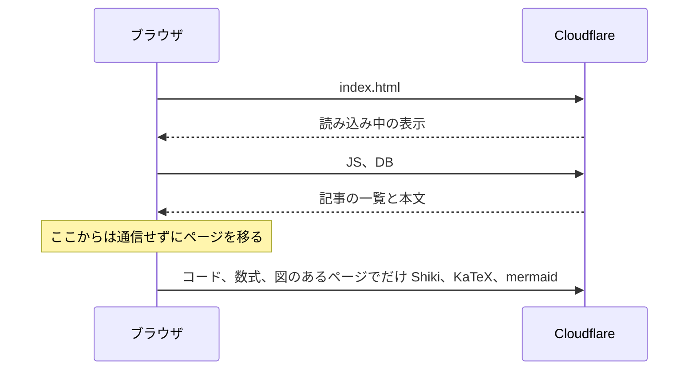

このブログは、記事の Markdown を Git で管理し、全記事を一つの SQLite ファイルにまとめて配信している。
ブラウザは最初にその SQLite を取得し、以後の記事一覧と記事の表示は、手元の DB を引くだけで動く。
記事から記事へ移っても、サーバに記事を取りに行くことはない。

## なぜ一つの SQLite なのか

記事ごとに JSON を配る方式ではなく一つのファイルにしたのは、公開の途中で中途半端な状態を見せないためだ。
DB は中身から決まるファイル名で配信されるので、参照が切り替わった瞬間に、必ず全記事がそろった状態が見える。
一覧にはあるのに本体がない、ということが起きない。

もう一つの理由は、SQLite のファイル形式が公開されていて、ブラウザの中でそのまま読めることだ。
このサイトは SQLite のライブラリ（wasm で約 320 KB）を読み込まず、ファイルの中の B-tree を自前の小さな読み手でたどって記事を読んでいる。
全文検索も、読んだ記事の文章から、ブラウザの中で探している。

## 画像は DB に入れない

画像は DB に入れず、静的なファイルとして配信する。
ブラウザのキャッシュがそのまま効き、DB を本文のテキストだけの大きさに保てる。
テキストだけなら、記事が千本あっても数 MB に収まる。

## 重いものは後から読み込む

Markdown はブラウザの中で HTML にする。
コードの色分け（Shiki）、数式（KaTeX）、図（mermaid）は大きいので、本体とは分けて、要るページでだけ後から読み込む。
コードの色分けは重いので、Web Worker の中で行い、その間もページの操作を妨げない。
読み込むまでは、コードは色なしで、数式は TeX のまま表示し、読み込めたら描き直す。
DB を読み込むまでの間は、HTML に直接書いた「読み込み中」の表示を出している。

## リンクカードの画像

URL だけの行はリンクカードになる。
カードの画像は、ブラウザではなく `sqlite-cms` がビルドのときにそのページから取ってきて、このサイトから配信している。
読む人のブラウザが、ほかのサイトと通信することはない。

## 使っているもの

- sqlite-cms（Rust）：記事を検証して SQLite にまとめ、Cloudflare に公開する
- Preact、Tailwind：表示
- SQLite の読み手（自前）：ブラウザの中で DB のファイルを読む
- react-markdown：Markdown の表示。Zenn 風の拡張の記法は自前のプラグインで読む
- Shiki：コードの色分け
- KaTeX：数式
- mermaid：図
