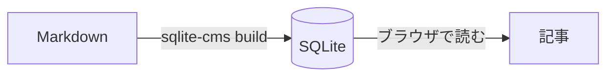

[記法の一覧](/articles/syntax) の Markdown と GFM に加えて、[Zenn の記法](https://zenn.dev/zenn/articles/markdown-guide)を参考にした拡張が使えます。

## メッセージ

:::message
補足はこう書きます。中には **Markdown** が書けます。
:::

:::message alert
注意してほしいことは `alert` を付けて書きます。
:::

```markdown
:::message
補足
:::

:::message alert
注意
:::
```

## 折りたたみ

:::details 折りたたみの見出し
押すと開きます。

- 中にはリストや
- コードブロックも書けます
:::

入れ子にするときは、外側のコロンを増やします。

::::details 外側
:::message
内側のメッセージ
:::
::::

````markdown
::::details 外側
:::message
内側のメッセージ
:::
::::
````

## コードのファイル名と diff

言語名の後に `:` で区切ってファイル名を書くと、コードの上に表示されます。

```ts:greeting.ts
export function greet(name: string): string {
  return `こんにちは、${name}さん`;
}
```

`diff` と言語名を空白で区切って並べると、変更の行と言語の色分けを同時に付けます。

```diff ts:greeting.ts
@@ -1,3 +1,3 @@
 export function greet(name: string): string {
-  return `Hello, ${name}`;
+  return `こんにちは、${name}さん`;
 }
```

## 数式

`$$` で囲むと数式のブロックになります。

$$
e^{i\theta} = \cos\theta + i\sin\theta
$$

$a \ne 0$ のとき、$ax^2 + bx + c = 0$ の解は $x = \frac{-b \pm \sqrt{b^2 - 4ac}}{2a}$ です。
$5 や $10 のような金額は数式になりません。

## 図

言語名を `mermaid` にしたコードブロックは図になります。



## 画像の幅と説明

URL の後に ` =幅x` を書くと、画像の幅を px で指定できます。
画像のすぐ下の行に `*` で囲んだ文字を書くと、画像の説明として表示されます。


*幅を 160px にした画像*

## インラインの脚注

`^[内容]` と書くと、その場で脚注を書けます^[番号は通常の脚注と合わせて振られます]。

## リンクカード

URL だけの行はカードとして表示されます。

https://zenn.dev/zenn/articles/markdown-guide

カードには、ホスト名と URL と、そのページの画像（OGP の画像）を表示します。
画像は `sqlite-cms` がビルドのときに取得し、このサイトから配信します。ページの題名は取得しません。
