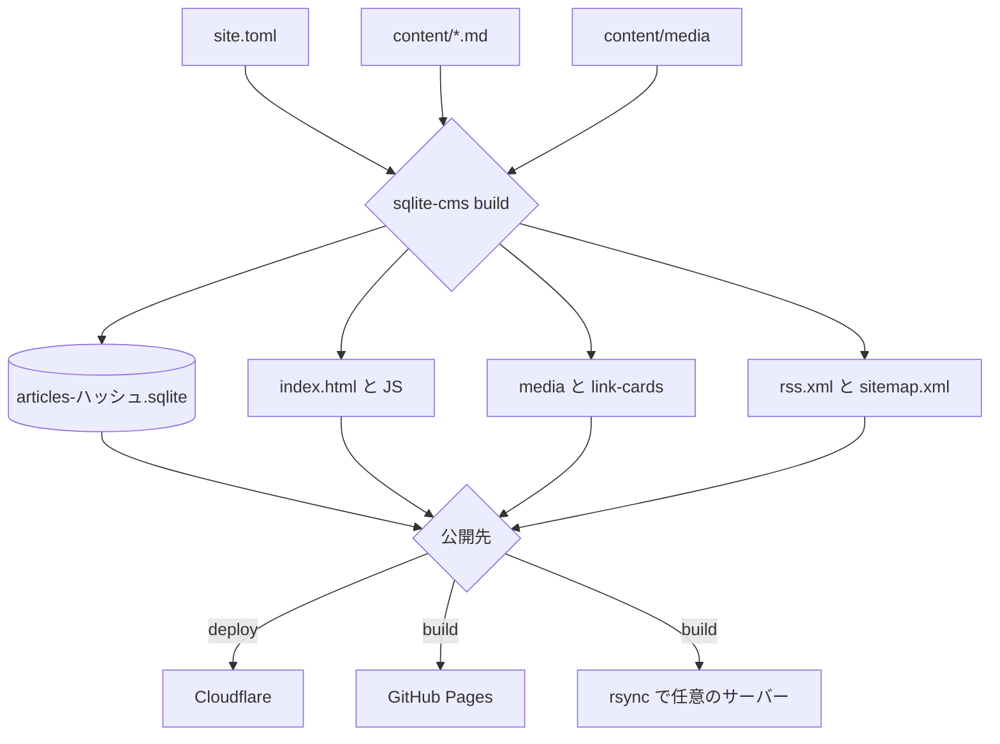
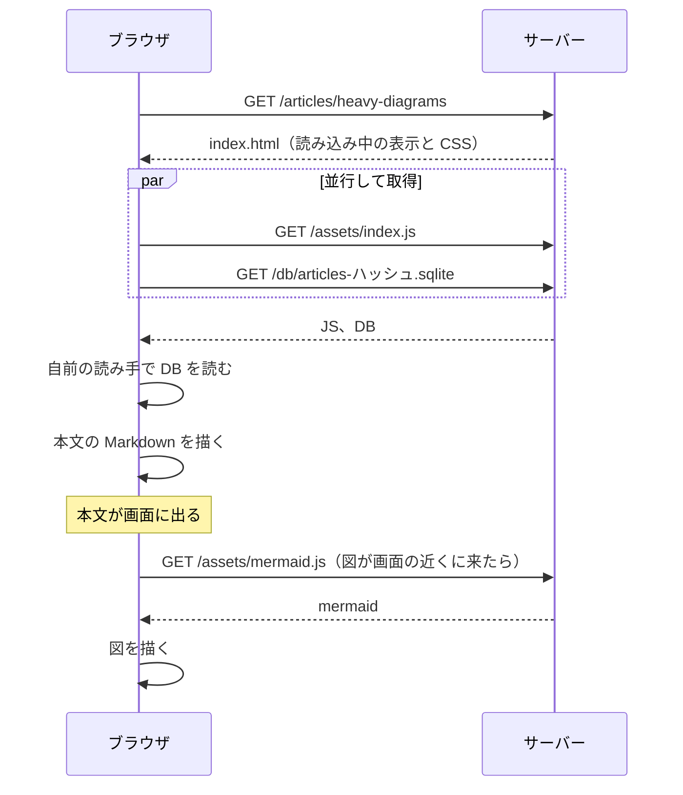
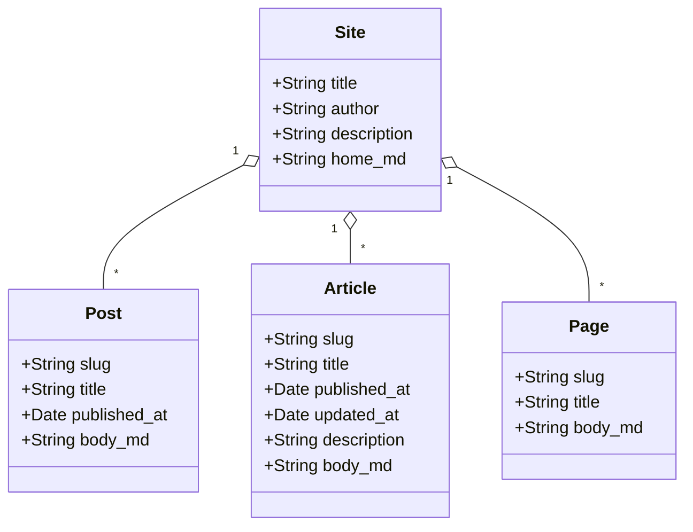
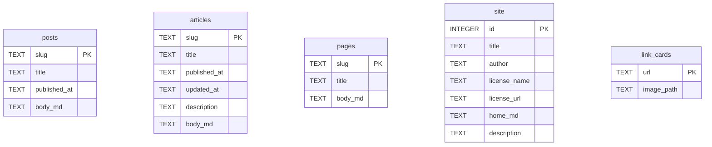
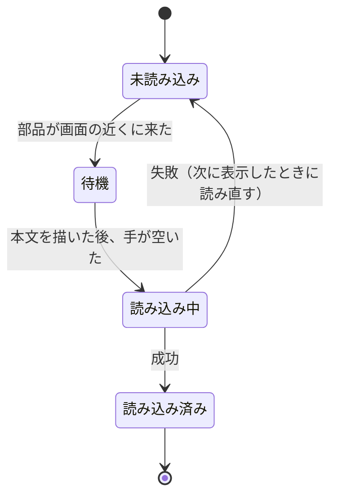
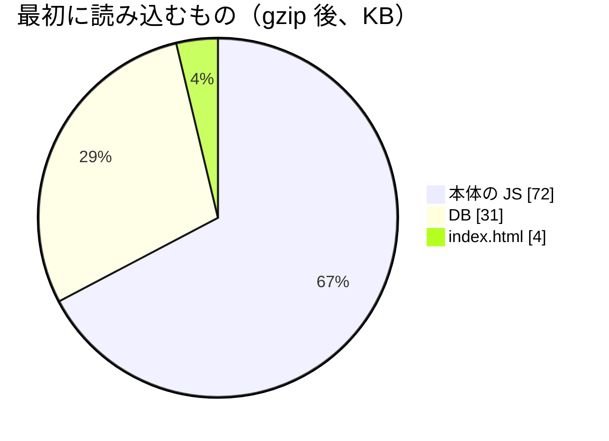
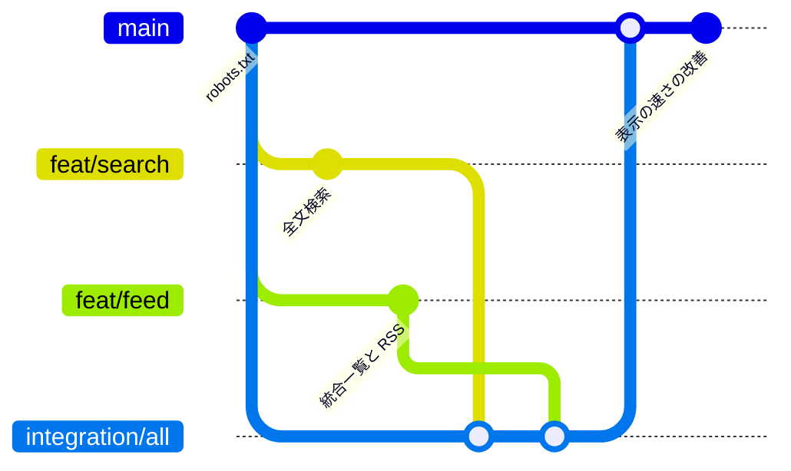
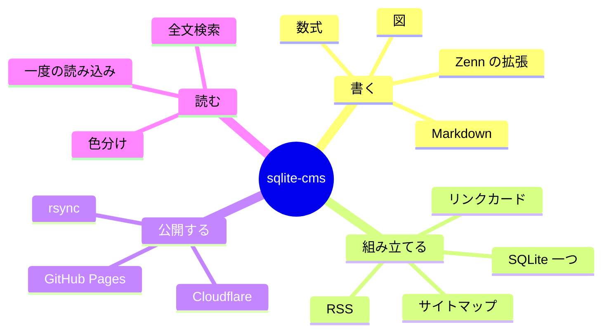
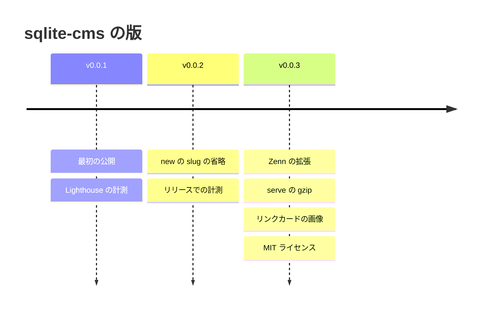
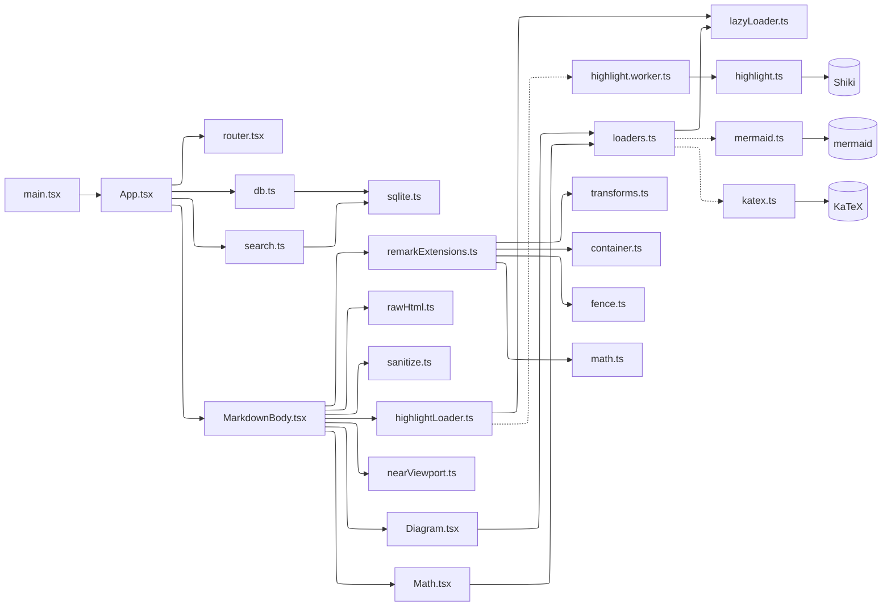

:::message
このページは、表示の重さを確かめるための見本です。
図が多い記事で、mermaid の読み込みと図の描画が、本文の表示や入力への応答をどれだけ遅らせるかを Lighthouse で計測しています。
:::

sqlite-cms の仕組みを、いろいろな種類の図で描きます。

## 組み立ての流れ（フローチャート）



## ページを開いたときの通信（シーケンス図）



## 記事の種類（クラス図）



## DB のテーブル（ER 図）



## ライブラリの読み込み（状態遷移図）



## 最初に読み込むもの（円グラフ）

gzip 後の大きさ（KB）の目安です。



## 作業の流れ（Git のグラフ）



## 機能の一覧（マインドマップ）



## 版の歴史（年表）



## モジュールの関係（elk のレイアウト）

`layout: elk` を指定すると、大きな図を elk で並べます。点線は、必要になったときに読み込むもの（動的 import）です。



## 書き誤りのある図

mermaid が読めない図は、図の文字列のまま表示します。

```mermaid
flowchart TD
  A --> 
```
