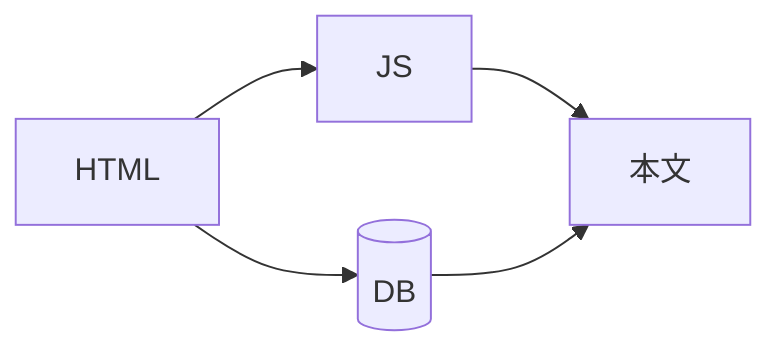
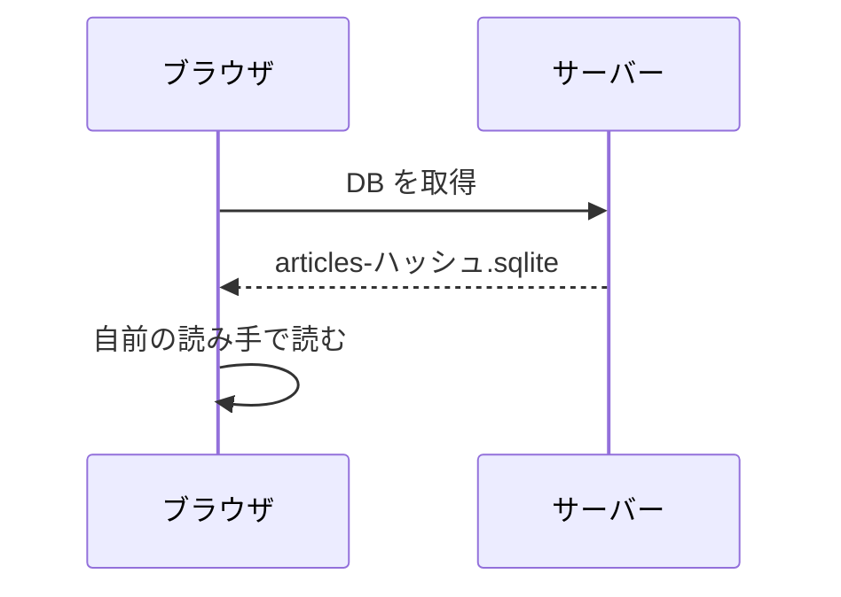
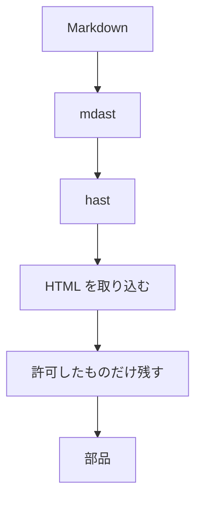
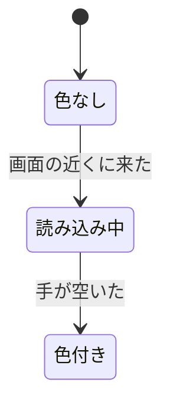
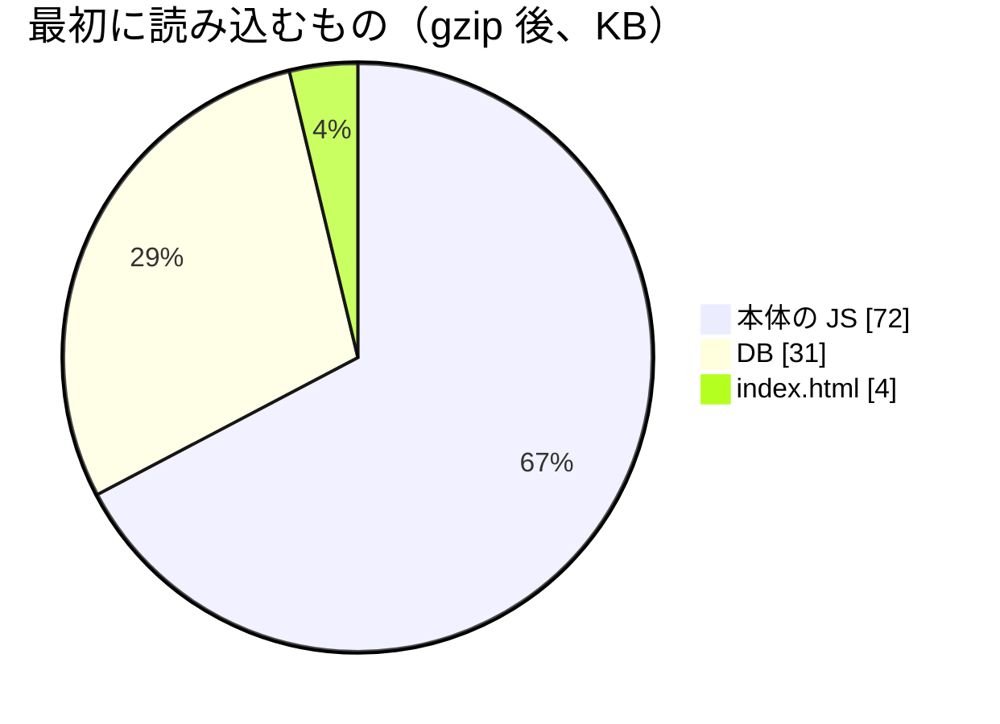
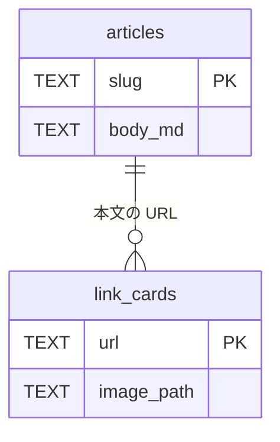
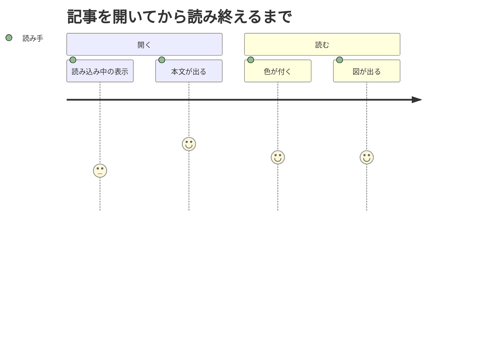

:::message
このページは、表示の重さを確かめるための見本です。
コードの色分け（Shiki）、数式（KaTeX）、図（mermaid）を一つのページで使い、どれも画面の最初から見える位置に置いています。
三つのライブラリの読み込みと処理が重なったときの重さを計測しています。
:::

最初の画面に、コード、数式、図をそろえて置きます。

```ts:loadDb.ts
const [SQL, bytes] = await Promise.all([initSqlJs(), fetch(dbPath).then((r) => r.arrayBuffer())]);
const db = new SQL.Database(new Uint8Array(bytes));
```

取得にかかる時間は、おおよそ $t \approx \text{RTT} + \dfrac{\text{大きさ}}{\text{帯域}}$ です。



## 一. DB を開く

ブラウザは、DB のファイルを取得して、自前の読み手で読みます。

https://github.com/tett23/sqlite-cms

```rust:output.rs
/// index.html に、DB の先読みを入れる。
fn preload(href: &str) -> String {
    format!("<link rel=\"preload\" href=\"{href}\" as=\"fetch\" crossorigin=\"anonymous\" />")
}
```

DB の大きさを $S$、帯域を $B$ とすると、取得の時間は $S / B$ に比例します。
$S = 31\,\text{KB}$、$B = 200\,\text{KB/s}$ なら、$0.155$ 秒です。

$$
T_{\text{本文}} = \max\left( T_{\text{JS}},\ T_{\text{DB}} \right) + T_{\text{描画}}
$$



## 二. 本文を描く

本文の Markdown は、ブラウザで HTML にします。


*記事が読み手に届くまで*

```tsx:Article.tsx
export function Article({ slug }: { slug: string }) {
  const { db } = useDb();
  const article = db ? getArticle(db, slug) : null;
  if (!article) return <Loading />;
  return <MarkdownBody source={article.bodyMd} />;
}
```

描画の手間は、本文の要素の数 $n$ にほぼ比例して $O(n)$ です。
入れ子の深さを $d$ とすると、木をたどる手間は次のとおりです。

$$
\sum_{i=0}^{d} b^i = \frac{b^{d+1} - 1}{b - 1} \qquad (b > 1)
$$



## 三. 色を付ける

コードブロックは、画面の近くに来てから色を付けます。

```diff ts:lazyLoader.ts
-    loader.load();
+    return whenIdle(() => {
+      loader.load().catch((error: unknown) => onError?.(error));
+    });
```

```python:estimate.py
def blocking_time(tasks: list[float]) -> float:
    """50 ms を超えた分を足し合わせる（Total Blocking Time）。"""
    return sum(max(0.0, task - 50.0) for task in tasks)
```

Total Blocking Time は、長いタスクの長さ $t_i$ から次のように求めます。

$$
\mathrm{TBT} = \sum_{i} \max(0,\ t_i - 50\,\text{ms})
$$



## 四. 数式を描く

https://zenn.dev/zenn/articles/markdown-guide

数式は KaTeX で描きます。文中の $\alpha$、$\beta$、$\gamma$ と、ブロックの数式を混ぜます。

$$
\begin{pmatrix} \cos\theta & -\sin\theta \\ \sin\theta & \cos\theta \end{pmatrix}
\begin{pmatrix} x \\ y \end{pmatrix}
=
\begin{pmatrix} x\cos\theta - y\sin\theta \\ x\sin\theta + y\cos\theta \end{pmatrix}
$$

```haskell:Rotate.hs
rotate :: Double -> (Double, Double) -> (Double, Double)
rotate theta (x, y) = (x * cos theta - y * sin theta, x * sin theta + y * cos theta)
```

| 角度 | $\cos\theta$ | $\sin\theta$ |
|---|---|---|
| $0$ | $1$ | $0$ |
| $\dfrac{\pi}{6}$ | $\dfrac{\sqrt{3}}{2}$ | $\dfrac{1}{2}$ |
| $\dfrac{\pi}{4}$ | $\dfrac{\sqrt{2}}{2}$ | $\dfrac{\sqrt{2}}{2}$ |
| $\dfrac{\pi}{2}$ | $0$ | $1$ |

## 五. 図を描く



```sql:size.sql
SELECT 'articles' AS kind, COUNT(*) AS count, SUM(LENGTH(body_md)) AS bytes FROM articles
UNION ALL
SELECT 'posts', COUNT(*), SUM(LENGTH(body_md)) FROM posts;
```



## 六. まとめ

:::details 三つのライブラリの大きさ（gzip 後）
| ライブラリ | 大きさ | 読み込むとき |
|---|---:|---|
| Shiki | 約 160 KB | 色を付ける言語のコードブロックが画面の近くに来たとき |
| KaTeX | 約 80 KB | 数式が画面の近くに来たとき |
| mermaid | 数百 KB | 図が画面の近くに来たとき |
:::

```yaml:lighthouse.yml
pages:
  - /articles/complex-mixed
required:
  accessibility: 100
  best-practices: 100
```

$$
\text{点数} = \sum_{m} w_m \cdot s_m, \qquad \sum_{m} w_m = 1
$$


